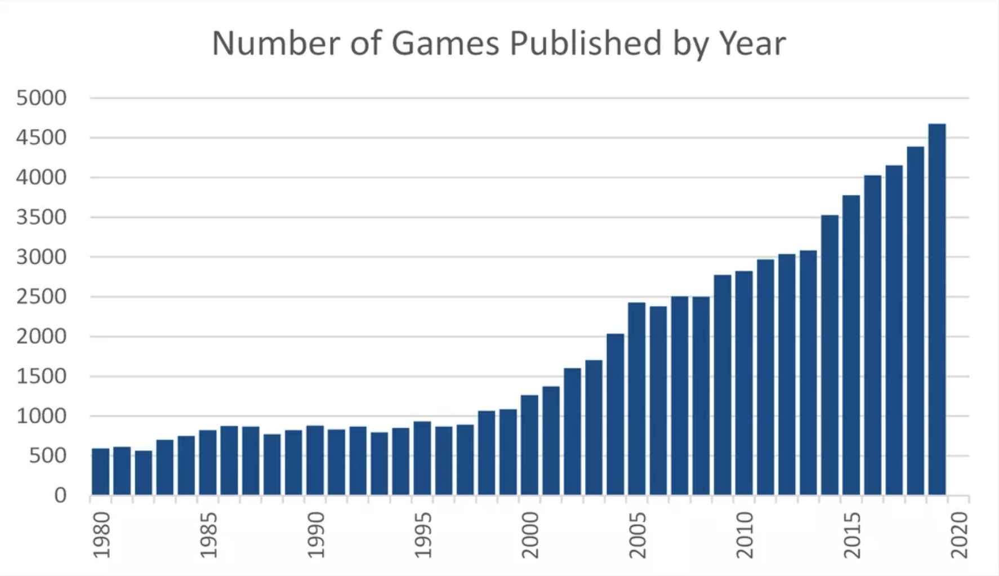

```{r load packages and set options, include=FALSE}
library(tinytex)
library(tidyverse)
library(knitr)
library(haven)
library(ggplot2)
library(rcompanion)
library(geometry)
library(data.table)
library(lmtest)
library(sandwich)
library(stargazer)
library(groupdata2)
library(ggdag)
library(dagitty)
library(GGally)
library(factoextra)
library(corrplot)
library(scales)
source("helper.R")

theme_set(theme_bw())
```

# 1 Introduction

## 1.1 Motivation
Our society is currently living in a board game renaissance. More than 5,000 new board games or expansions are released every year according to online resource Board Game Geek [(Source)](https://www.usnews.com/news/health-news/articles/2020-12-24/board-games-can-be-a-lifeline-in-covid-lockdown). With new games being created day after day, players are turning to explore more heavily-themed and complex innovations that can make games take hours and even days to play.


Figure: Number of board games published by year according to BGG advanced search. Expansions removed [(Source)](https://boardgamegeek.com/thread/2556595/number-games-published-year)

The board game industry has undergone a huge development over hundreds of years, and with that comes the birth of many new genres and mechanics that make board games more diverse and complex. The development starts with “ancient” games which included race games and war games (i.e. Chess and Go), then become more colorful and narrative filled with the printing press in the 15th century. Classic board games like Candyland, Monopoly, Sorry, and Scrabble entered the picture in the earlier nineteen-hundreds. And finally, hobby and competitive games are experiencing the “biggest explosion” which are “more complex that traditional games and involve strategy” [(Source)](https://www.pitt.edu/pittwire/features-articles/rise-board-games-today-s-tech-dominated-culture).

The “hobby” games are supported by a gaming culture that only continues to grow as a result of increasing technology and video game capabilities, more free time, competitive play, and more. The development of new board games is exceptionally supported by platforms and events such as Kickstarter, conventions, and hobby game stores. According to Polygon.com, backers pledged over \$176 million to tabletop games in 2019, compared to just $16 million to video games. A surge in board game stores and cafes popped up in cities over the last decade. They promote play and purchase of board games as well as tabletop and trading card games (TCGs) through building community and competitive tournaments that support professional leagues.

Pandemic years are no exception to the popularity surge. Free time during the COVID-19 lockdowns have increased board game sales to new records. [Sales soared](https://www.forbes.com/sites/joanverdon/2020/04/01/sales-of-board-games-crafts-puzzles-soar-as-america-stays-home/?sh=57eec62762b0) during the year of 2020 as board game casuals and enthusiasts stayed home. The global Games and Puzzles market reached a value of \$11.3 billion in 2020, which is a \$1 billion increase on the $10.4 billion recorded in 2019 [(Source)](https://www.dicebreaker.com/categories/board-game/news/games-and-puzzles-market-2020-2021). The Games and Puzzles category includes tabletop, board games, card games, and tabletop RPGs along with jigsaw and traditional puzzles.

## 1.2 Research Question

With this knowledge of a constantly-developing and diversifying market, we understand that not all board game innovations are successful. As new categories, mechanics, and complexities are introduced, we strive to understand what makes board games more enjoyable and what doesn’t. Specifically, we aim to answer the research question:

\textit{How does the complexity of a board game affect its rating?}

Newer board games bring in a wide range of complexity that didn't previously exist. In this study, we explore the relationship of board game complexity and the user rating it receives as this information can help us to understand the importance of complexity. As we continue to develop new games, our goal is to use this information to make decisions on the complexity level we design for, to satisfy enthusiastic board game players.

Websites like Board Game Geek, The Dice Tower, and Shut Up and Sit Down are platforms where board game and tabletop gamers can discuss their hobby, share reviews and get recommendations on games. We will utilize information from BoardGameGeek.com to analyze our research question. Detailed information around the data will be discussed in the next section.

# 2 Data and Methodology

## 2.1 About the Data

Our analysis leverages data scraped from [BoardGameGeek.com](boardgamegeek.com), an online platform and community that aims to be the definitive source for board game/tabletop and card game content. Board Game Geek has an extensive database of more than 20,000 board games as well as an active community of users who discuss, buy, sell, trade, and play board games. Each game has its own game entry with information about the game, user ratings, forums for discussion, and more.

```{r load data, echo = FALSE, message = FALSE, include=FALSE}
reviews <- fread("../data/reviews.csv", stringsAsFactors = FALSE, na.strings = c("", "NA"))
games <- fread("../data/games.csv", stringsAsFactors = FALSE, na.strings = c("", "NA"))
complexity <- fread("../data/complexity.csv", stringsAsFactors = FALSE, na.strings = c("","NA"))
```

```{r split categories, echo = FALSE, message = FALSE, include=FALSE}
# Explode categories to dummy variables (one-hot encoding)
split_categories = unlist(strsplit(games$category, ",", fixed = TRUE))
df <- as.data.frame(split_categories)
df$all_categories <- trimws(df$split_categories, which = c("both"))

split_categories_freq <- df %>%
  group_by(all_categories) %>%
  dplyr::summarize(count=n()) %>%
  arrange(desc(count))

n_category <- nrow(split_categories_freq)
category_list <- split_categories_freq$all_categories

grouped_categories_freq <- games %>%
  group_by(category) %>%
  dplyr::summarize(count=n()) %>%
  arrange(desc(count))

games <- explode(games, "category", noval = "Empty")
names(games) <- gsub(" ", "", names(games))
names(games) <- gsub("'", "", names(games))
```

```{r join data, echo = FALSE, message = FALSE}
setDT(games)
setkey(reviews, 'game_id')
setkey(games, 'game_id')
setkey(complexity, 'game_id')
data <- reviews[games]
data <- data[complexity]
```

Three different data sources are scraped from Board Game Geek to be utilized in our research: **reviews**, **games**, and **complexity**. Both the **reviews** dataset and the **games** dataset require a complete list of Board Game Geek board game IDs in order to fetch results through the XML API.

We retrieve the list of game IDs through the [bgg-ranking-historicals](https://github.com/beefsack/bgg-ranking-historicals) GitHub repository by GitHub user [Beefsack](https://github.com/beefsack). Game IDs are scraped every day from Board Game Geek and added to this repository as CSV files. For this research iteration, we use the CSV file scraped on [November 18, 2021](https://raw.githubusercontent.com/beefsack/bgg-ranking-historicals/master/2021-11-18.csv) and utilize this information on the same day to scrape our own data.

**Reviews data**: XML data is retrieved and then scraped for each board game in batches of one hundred. Board Game Geek provides an XML API called [BGG XML API2](https://boardgamegeek.com/wiki/page/BGG_XML_API2). We use our collection of board game IDs to fetch XML data that we then parse to gather information on username, rating, and comments. To treat dependency of reviews within each board game, we omit ratings that occur after the Board Game Geek user has already rated the game once. With only the first rating kept for each game, 2,079,515 duplicate user reviews were removed.

The data was scraped on November 18, 2021, resulting in `r nrow(reviews)` reviews for all board games in the database with `r ncol(reviews)` variables.

**Games data**: XML data is retrieved and then scraped for each board game individually. Using the same [BGG XML API2](https://boardgamegeek.com/wiki/page/BGG_XML_API2), we are able to use our collection of board game IDs to fetch XML data. We parse the XML data to gather information on each board game including board game name, year published, minimum and maximum number of players, minimum age, category, mechanics, and more.

The `category` variable is a string of multiple categories that the board game falls into, separated by comma. We split the category strings and one-hot encode to create representation of all `r n_category` categories to achieve our research design goals.

The data was scraped on November 18, 2021, resulting in `r nrow(games)` board games collected with `r ncol(games)` variables.

**Complexity data**: The complexity of each board game is polled from users as a 1-5 rating on every board game homepage. For each board game, we use the Board Game Geek JSON API to retrieve the ID of the complexity poll for that game ID. We then use the same JSON API to query the results of that poll, and calculate the votes into a single complexity score.

The data was scraped on November 18, 2021, resulting in `r nrow(complexity)` board games collected with `r ncol(complexity)` variables: `game_id` and `complexity`.

These three datasets are combined using the common `game_id` defined by Board Game Geek. This resulting dataset provides us with `r nrow(data)` rows and `r ncol(data)` columns for analysis. The full joined dataset contains reviews of `r nrow(games)` games from `r length(unique(data$user))` distinct users.

```{r clean, warning=FALSE, message = FALSE, include=FALSE}
data <- clean(data)
```

```{r data split, echo = FALSE, message = FALSE, include=FALSE}
set.seed(1)
partition_result <- partition(
  data = data,
  p = 0.3,
  list_out = TRUE
)

explore_df <- partition_result[[1]]
final_df <- partition_result[[2]]
```


Minor cleanup steps are performed to ensure that our data is accurate for the needs of our analysis. These steps include removing NA values of our outcome variable `rating` and big complexity players `complexity`, `min_age`, and `playtime`. We ensure to only include games where minimum and maximum playtime are in logical order and the year published does not exceed the current year 2021.

The data is split into an explore set (30% split, `r nrow(explore_df)` rows) and a test dataset (70% split, `r nrow(final_df)` rows) for our research design. We conduct exploratory data analysis on the 30% split to identify variables and relationships we want to portray in our model; then, we use the 70% split to build our models using the selection from our EDA as an effort to reduce bias.


## 2.2 Rating Characteristics

The `rating` variable is our outcome variable as identified in our research question. Every review in our dataset includes a user rating with a value between 1 and 10. Users can optionally leave a comment in their review along with the rating.

```{r rating plot, warning=FALSE, message = FALSE, include=FALSE}
rating_table <- explore_df %>% count(rating_int)
rating_avg <- mean(explore_df$rating_int)

rating_dist_plot <- ggplot(data=rating_table, aes(x=rating_int, y=n)) +
  geom_bar(stat="identity", fill="skyblue3", width=1) +
  scale_x_continuous(breaks=1:10) +
  labs(
    title="Distribution of Board Game Ratings",
    x = "Rating (1-10)",
    y = 'Count of Ratings') + geom_vline(xintercept = rating_avg)

```

The Board Game Geek rating system provides guidelines to users as games are rated, shown in the following:

* 10 - Outstanding. Always want to play, expect this will never change.
* 9 - Excellent. Always want to play.
* 8 - Very good. Like to play, will probably suggest it, will never turn it down.
* 7 - Good. Usually willing to play.
* 6 - Fair. Some fun or challenge at least, will play occasionally if in the right mood.
* 5 - Average. No significant appeal, take it or leave it.
* 4 - Below average. Slightly boring, could be talked into it on occasion.
* 3 - Poor. Likely won't play this again although could be convinced.
* 2 - Very poor. Annoying, I plan to never play this again.
* 1 - Defies description of a game. You won't catch me dead playing this. Clearly broken.

```{r rating_dist plot, warning=FALSE, message = FALSE, echo = FALSE, fig.cap='Board Game Rating Distribution (1-10 Rating Scale)', fig.height = 3}
rating_dist_plot
```

With a 1-10 rating scale, we observe that the middle score according to these guidelines is 5.5. The distribution of our sample is relatively normal with a left skew and an average rating of `r rating_avg` indicated with a vertical line in Figure 1. This left skew shows us that reviewers on Board Game Geek are generally optimistic in their reviews, which could be a result of a number of reasons. Potential reasons for this include that users on Board Game Geek may be more prone to spend their time rating and recommending their favorite games, or that Board Game Geek users own and play games under themes, categories, or mechanics that they hypothesized to enjoy before trying the game.

```{r reviews per, include=FALSE}
reviews_per_game <- explore_df %>% count(name, sort = TRUE)
reviews_per_user <- explore_df %>% count(user, sort = TRUE)
```

Our data sample includes `r nrow(reviews_per_game)` unique board games with the number of reviews ranging from a minimum of `r min(reviews_per_game$n)` (Kortslutning) to a maximum of `r max(reviews_per_game$n)` (Pandemic). On average, a board game on Board Game Geek has `r round(mean(reviews_per_game$n), 2)` reviews.

Board Game Geek has a wide variety of review engagement for its users. With `r nrow(reviews_per_user)` unique reviewers in our sample, we observe that the max number of reviews a user has made is `r max(reviews_per_user$n)`, while the minimum is `r min(reviews_per_user$n)`. A user creates `r round(mean(reviews_per_user$n), 2)` reviews on average.


## 2.3 Board Game Characteristics

Preliminarily, we chose the following board game characteristic variables to analyze for our research design.

- `complexity`: the average user-rated complexity score for each board game on a scale of 1 to 5
- `year_published`: the year that the board game was published
- `min_players`: the minimum players required to play the game
- `max_players`: the maximum players able to play the game
- `min_playtime`: the minimum playtime for the game provided by Board Game Geek
- `max_playtime`: the maximum playtime for the game provided by Board Game Geek
- `min_age`: the minimum age required to play the game
- `category`: the categories that the game falls under

```{r year_published count, echo = FALSE, message = FALSE, include=FALSE}
game_year_df <- unique(explore_df[,c("game_id", "name", "year_published")])
```

```{r year_published, echo = FALSE, message = FALSE, include=FALSE}
year_grouped <- explore_df %>% filter(year_published >= 1921) %>%
  group_by(year_published) %>%
  summarise(n = n(), avg_rating = mean(rating_int))

year_rating_plot <- ggplot(data=year_grouped, aes(x=year_published, y=n, fill=avg_rating)) +
  geom_bar(stat="identity", width=0.75, position = 'dodge') +
  labs(
    title="Rating of Board Games by Published Year (1921 - 2021)",
    x = "Published Year",
    y = 'Number of Reviews',
    fill = 'Average Rating') +
  scale_fill_continuous(low="black", high="skyblue")
```

In our sample, we analyze a diverse range of publishing years for our board games. Our sample contains games published from year `r min(game_year_df$year_published)` to `r max(game_year_df$year_published)`, with `r nrow(game_year_df[game_year_df$year_published < 0,])` games having a publishing year of less than 0. These outliers represent relative ordering of older games compared to our current century as they include ancient games such as Go, Senet, Marbles, and Tic-Tac-Toe with an unknown "publishing" year.

```{r 2016 2021, echo = FALSE, message = FALSE, include=FALSE}
d2016 <- explore_df[explore_df['year_published'] == 2016,]
year_grouped_2016 <- d2016 %>% filter(year_published >= 1921) %>%
  group_by(name) %>%
  summarise(n = n(), avg_rating = mean(rating_int))

d2021 <- explore_df[explore_df['year_published'] == 2021,]
year_grouped_2021 <- d2021 %>% filter(year_published >= 1921) %>%
  group_by(name) %>%
  summarise(n = n(), avg_rating = mean(rating_int))
```

```{r year_rating plot, warning=FALSE, message = FALSE, echo = FALSE, fig.cap='Board game rating count and average by publishing year in the last 100 years', fig.height = 3}
year_rating_plot
```

As shown in Figure 2, board games that are published relatively recently tend to have a large number of reviews compared to games published earlier such as those published in the nineteen-hundreds. A peak of 394,628 total game reviews can be observed in the year 2016, when big-impact games like Terraforming Mars (21,621 reviews), Scythe (18,883 reviews), and Kingdomino (10,738 reviews) were published. The number of reviews per year then declines in the years following 2016, which can potentially be explained by those later-published games not having as much time to gather reviews on the BGG website. This pattern can especially be seen in the years 2020 and 2021, where games like Cascadia were just published last August (2021) and are just beginning to rack up reviews.

The surge in the number of board game reviews in the last decade could be an observation in support of the increasing popularity of board games in the "board game renaissance" as quoted by U.S. News [U.S. News](https://www.usnews.com/news/health-news/articles/2020-12-24/board-games-can-be-a-lifeline-in-covid-lockdown). We acknowledge that games published in the last decade have more representation in our analysis of user reviews.

Furthermore, Figure 2 shows an increasing trend in board game average ratings over publish year. For games published between 1921 - 2021, the earliest ten observations indicate average ratings between 3.46 and 6.42, while the latest 10 observations indicate average ratings between 6.96 and 7.55. The year with the best average rating thus far is 2020. As year published shows a convincing trend in how board games are rated, we consider using this variable as a control in our analysis of complexity to rating.

```{r summary table, echo = FALSE, message = FALSE, include=FALSE}
summary_table <- explore_df %>% group_by(rating_int) %>%
  summarise(avg_comp = mean(complexity),
            avg_min_age = mean(min_age),
            avg_min_playtime = mean(min_playtime),
            avg_max_playtime = mean(max_playtime))

names(summary_table) <- c('Rating', 'Average Complexity', 'Average Min Age',
                          'Average Min Playtime', 'Average Max Playtime')
```

Minimum age is one of our candidates to include into our definition of board game complexity. The minimum age to play the game ranges from `r min(explore_df$min_age)` to `r max(explore_df$min_age)`, with an average of `r round(mean(explore_df$min_age), 2)`.

```{r category, echo = FALSE, message = FALSE, include=FALSE}
game_category_df <- unique(explore_df[,c("game_id", "category")])

temp_split <- unlist(strsplit(game_category_df$category, ",", fixed = TRUE))
temp_cat_df <- as.data.frame(temp_split)
temp_cat_df$all_categories <- trimws(temp_cat_df$temp_split, which = c("both"))

sample_categories_freq <- temp_cat_df %>%
  group_by(all_categories) %>%
  dplyr::summarize(count=n()) %>%
  arrange(desc(count))

category_table <- head(sample_categories_freq)
names(category_table) <- c('Category', 'Number of Games')
```

We also consider board game category in our analysis as a control candidate for our user rating analysis. A board game can fall under multiple categories. With `r n_category` board game categories in our sample, we observe that the categories that hold the most board games are Card Game, Wargame, and Fantasy, observed in Table 1.

```{r category-table, echo = FALSE}
kable(
  category_table,
  digits = 2,
  caption = 'Frequency of Board Games by Category',
  booktabs = TRUE,
)
```

The minimum number of players for the games range from `r min(explore_df$min_players)` to `r max(explore_df$min_players)`, while the maximum number of players for the games range from `r min(explore_df$max_players)` to `r max(explore_df$max_players)`. The difference between minimum and maximum players for each game has an average of `r round(mean(explore_df$max_players - explore_df$min_players), 2)`; many games have a narrow margin for the number of players needed to play the game.

Board Game Geek provides complexity ratings, (referred to as weights) for each game. This complexity rating is an ordinal value, derived from averaging the Likert scale responses, in which users rate the game by answering the following question:

_How heavy (difficult/complex) is this game?_ with the following options:

- Light (1)
- Medium Light (2)
- Medium (3)
- Medium Heavy (4)
- Heavy (5)

The complexity ratings from Board Game Geek are intended to be a composite made up of factors such as:

- How complex/thick is the rulebook?
- How long does it take to play?
- What proportion of time is spent thinking and planning instead of resolving actions?
- How hard and long do you have to think to improve your chance of winning?
- How little luck is in the game?
- How much technical skill (math, reading ahead moves, etc) is necessary?
- How long does it take to learn the rules?
- How many times do you need to play before you feel like you "get" the game?

```{r summary-table, echo = FALSE}
kable(
  summary_table,
  digits = 2,
  caption = 'Average Board Game Metrics by Rating',
  booktabs = TRUE,
)
```

```{r, include=FALSE}
box_plot_df <- explore_df
box_plot_df$rating_int <- as.factor(box_plot_df$rating_int)

comp_rating_plot <- ggplot(box_plot_df, aes(x=complexity, y=rating_int, fill=rating_int)) +
  geom_boxplot(fill='skyblue3') +
  labs(
    title="Complexity Distribution by Rating",
    x = "Complexity",
    y = 'Rating')

```

```{r comp_rating plot, warning=FALSE, message = FALSE, echo = FALSE, fig.cap='Distribution of board game complexity by rating (1-10)', fig.height = 3}
comp_rating_plot
```

As we report in Table 2, the average complexity of board games where users rated a 1 is 2.07, while the average complexity of games where users gave ratings of 10 is 2.79. We can observe a pattern where complexity generally increases as user rating increases. A similar pattern can be observed for the other variables reported in Table 1: average minimum age, average minimum playtime, and average maximum playtime, which generally increase as rating increases.

Shown in Figure 3 is a series of boxplots indicating the complexity distribution differences based on the user ratings. The observed pattern in Table 2 is further supported through the boxplot medians for each rating. While board games with a rating of 1 have a higher average complexity score relative to ratings 2, 3, 4, and 5, the boxplot for ratings of 1 shows that there is a wider interquantile range as compared to that seen in the boxplots of the other ratings, indicating that there is more variance in complexity for ratings of 1.


## 2.4 Research Design

In this study, we aim to understand the relationship between game complexity and the user rating it receives and answer the research question "How does a board game's complexity affect its rating?". We focus on complexity as our main dependent variable of interest. In this study, we will go beyond the composite complexity variable, which is made up of user ordinal ratings, to include variables which describe characteristics of the game that may also be indicators of complexity and may provide additional explanatory power relating to complexity while not being fully captured in the complexity composite variable. These explanatory variables that we hypothesize may explain some of the complexity of the game that may not be captured by the complexity composite variable include minimum age, minimum playtime, and maximum playtime. Additionally, these are fixed variables placed on the game by the game manufacturer prior to publishing and are thus not subject to a differing distribution of raters nor to potential voter biases due to non-complexity related factors. We hypothesize that minimum age will increase with increased game complexity and vice-versa, for example, children's games will have lower minimum ages compared to a war strategy game. We also hypothesize that minimum and maximum playtime will tend to increase with more complex games as it is expected that their will generally be more time required for strategizing.

A correlational research design approach will be used with it being hypothesized that complexity will influence the way in which people rate games on Board Game Geek. Given the vast number of observations from the Games, Complexity, and Rating datasets scraped from Board Game Geek, allow for the joined dataset to provide more than enough observations for the the large-sample linear model to be employed. Our models will comprise of one outcome variable - rating - and multiple explanatory variables. The rating variable is roughly normally distributed, having slight negative skewness with a median rating of 7; however, as the large-sample model assumptions are the only assumptions which must be met in this study, normality of the variables nor their residuals is a necessity.

# 3 Modeling

We plan to use the complexity rating in our analysis, as it is intended to be a composite made up of factors defined by Board Game Geek discussed in section 2.3 of this report. We consider the minimum age, minimum playtime, and maximum playtime explanatory variables as additional indicators of complexity. Additionally, we chose to use robust standard errors clustered by users and games, allowing us to take into account this non-independence.

Beyond the complexity data, we will develop models which use other available variables, including explanatory variables that may be indicators of complexity, but which are not fully captured by the complexity composite variable, as well as other control variables. The other explanatory variable candidates which we suspect to be indicators of complexity were generally moderately positively correlated with the complexity composite variable. As these variables are only moderately positively correlated, they will be included in some of the models, bearing in mind that some of the complexity of the game may be explained by these other explanatory variables, thus impacting their inferred effect sizes. We will assess the stability of the effect size of the complexity composite variable as these variables are added to the model.

In addition to the complexity variable, we will develop models with the following explanatory and control variables:

- minimum age
- play time (minimum and maximum)
- number of players needed (minimum and maximum)
- game age
- category

There is an issue of dependency in this dataset as users may rate multiple games, and games have ratings by multiple users. In order to account for this non-independence we calculated standard errors by clustering by user and game names.

As depicted in the exploratory data analysis section, the minimum and maximum play time had large ranges and high leverage points. Thus, we chose to winsorize the max player values, limiting them to a maximum of 15. Based on skewness in the distributions, the maximum number of players, the minimum number of players, and the maximum playtime were log10 transformed. The year published contained negative values, presumably BC, and showed high negative skewness; therefore, this variable was converted to the game age and log10 transformed: this shifted the negative skewness to positive skewness and allowed log10 tranformation to reduce it.


```{r ggpairs, echo=FALSE, message=FALSE, warning=FALSE, include=FALSE}
d_gg_pairs <- final_df %>%
  select(rating_int, complexity, game_age, min_players, max_players, min_playtime, max_playtime, min_age)

# g <- ggpairs(data=d_gg_pairs,
#              lower = list(continuous = wrap("points", size=0.01,alpha=0.3)))
# 
# g + theme(text=element_text(size=6)) +
# scale_y_continuous(labels = comma) +
#  scale_x_continuous(labels = comma) +
#   theme(axis.text.x = element_text(angle = 45),
#         axis.text.y = element_text(angle = 45))

```

Rather than use all 85 one-hot encoded category variables, we chose to use Principal Component Analysis (PCA) to abstract fewer synthetic variables. Each game can belong to multiple categories with a total of 85 categories in the dataset. Thus, we have 85 indicator variables for each of these categories which can be cumbersome to model; it behooves us to reduce the dimensionality of our dataset while maintaining a significant portion of information in which these categories provide. PCA enables us to do this.

Based on the plot below we narrowed our original set of 85 category variables to 6 principal components that explained 36% of the total variance in the category matrix to be used as control variables in our linear models:

```{r - PCA, echo=FALSE, include=FALSE}
d_categories <- final_df[,grep('category_',names(final_df))]
pca <- prcomp(d_categories[,])

d_final_with_pcs <- cbind(final_df, pca$x[,1:6])

pca_scree_plot <- fviz_eig(pca, addlabels = TRUE) + labs(title = "Category Variables PCA")
```

```{r pca plot, warning=FALSE, message = FALSE, echo = FALSE, fig.cap='Category Variables PCA', fig.height = 3}
pca_scree_plot 
```


## 3.1 Base Model

In the first iteration of modeling, we include only the primary explanatory variable of interest, the complexity variable:

$$
  rating = \beta_{0} + \beta_{1}complexity
$$

```{r model no covariates, include = FALSE}
model_no_covariates <- lm(rating_int ~ complexity, data=final_df)
model_no_covariates_fit <- summary(model_no_covariates)$r.squared
model_no_covariates_explanatory_power_perc <- model_no_covariates_fit*100

```

In the base model without covariates, we determine that the complexity variable is statistically significant. This suggests our hypothesis is correct, but p-values may be misleading given the large number of observations, suggesting we should instead focus on the effect size of complexity on rating. The overall model has a coefficient of determination of `r round(model_no_covariates_fit,3)`, indicating that `r round(model_no_covariates_explanatory_power_perc,1)`% of the variance in the outcome (rating) variable is being described by the base model. The effect size of complexity is `r round(model_no_covariates$coefficients[2],3)`, indicating that a one unit increase in complexity increases the rating by `r round(model_no_covariates$coefficients[2],3)` units.

## 3.2 Second Model

In our second model, we include additional explanatory variables that are part of how we define complexity:

- Minimum age (min_age): A simple game likely has a low minimum age; a more complex game likely has a higher minimum age.
- Minimum playtime (min_playtime): A simple game likely has a low minimum play time; a more complex game likely has a higher minimum playtime. We note that due to positive skewness, we will log base 10 transform this variable for modeling.
- Maximum playtime (max_playtime): As expected and shown in the correlation plot in section 5.1, maximum playtime and minimum playtime are moderately-highly positively correlated and are likely providing some of the same information. We will however include both of these variables in our model; bearing in mind that we must be careful in interpreting the effect size of these two variables. We note that due to the positive skewness of this variable that it will be log base 10 transformed for modeling.

The second model assessed is thus as follows:

$$
  rating = \beta_{0} + \beta_{1}complexity + \beta_{2}min\_age + \beta_{3}log_{10}(min\_playtime)
  + \beta_{4}log_{10}(max\_playtime)
$$

```{r linear models, include=FALSE}
model_with_additional_explanatory_vars <- lm(rating_int ~ complexity + min_age + log10(min_playtime) + log10(max_playtime), data=final_df)
```

## 3.3 Third Model

In our third model, we include other control variables to account for aspects of the game that may affect user ratings:

- Years since publishing (age of game): As board games have become more popular in recent years, there has been an increase in the number and types of mechanics by which games are played; likely, a higher age (indicating an older game) would correlate with a simpler game.
- Minimum number of players: At first thought, one might believe that a lower minimum number of players would correspond to a simpler game. However, incredibly complex games like chess and go are two player games. We thus control for the number of players rather than treating it as an explanatory variable.
- Maximum number of players: Similar to the minimum number of players, a higher maximum number of players wouldn't necessarily positively correlate with a more complex game. We thus control for the number of players rather than treating it as an explanatory variable. We note that due to the positive skewness of values for this variable, we will log10 transform this variable.

The third model assessed is thus as follows:

$$
  \begin{split}
  rating = \beta_{0} + \beta_{1}complexity + \beta_{2}min\_age + \beta_{3}log_{10}(min\_playtime) + \beta_{4}log_{10}(max\_playtime) \\
  + \beta_{5}log_{10}(age) + \beta_{6}min\_players + \beta_{7}log_{10}(max\_players)
  \end{split}
$$

```{r model 3, include=FALSE}
model_with_additional_explanatory_and_control_vars <- lm(rating_int ~ complexity + min_age + log10(min_playtime) + log10(max_playtime) + log10(game_age) + min_players + log10(max_players), data=final_df)
```

## 3.4 Fourth Model

In the fourth model, we include the first 6 principal components created by the category matrix as additional control variables.

Some categories of games likely have naturally higher complexity; categories thus create "clusters" of complex or simple games. Controlling for game category mitigates this issue.

Our fourth model is thus as follows:

$$
  \begin{split}
  rating = \beta_{0} + \beta_{1}complexity + \beta_{2}min\_age + \beta_{3}log_{10}(min\_playtime) + \beta_{4}log_{10}(max\_playtime) \\
  + \beta_{5}log_{10}(age) + \beta_{6}min\_players + \beta_{7}log_{10}(max\_players) \\
  + \beta_{8}PC1 + \beta_{9}PC2 + \beta_{10}PC3 + \beta_{11}PC4 + \beta_{12}PC5 + \beta_{13}PC6
  \end{split}
$$

```{r model with PCA, include=FALSE}
model_with_additional_explanatory_and_control_vars_incl_pcs <- lm(rating_int ~ complexity + min_age + log10(min_playtime) + log10(max_playtime) + log10(game_age) + min_players + log10(max_players) + PC1 + PC2 + PC3 + PC4 + PC5 + PC6, data=d_final_with_pcs)
```

## 3.5 Robust Standard Errors

Robust clustered standard errors are used here to address non-independence issues. First, users may rate multiple games and these ratings are thus not independent. Second, each game has only one value for each explanatory variable, with ratings within games also therefore correlated. Therefore, robust standard errors clustering for both user and game are used.

```{r standard errors - transformed models, include=FALSE}
model_no_covariates_coeffs_cl <- coeftest(model_no_covariates, vcovCL(model_no_covariates, type='HC0'), cluster=~user+name)
se1_cl <- model_no_covariates_coeffs_cl[,'Std. Error']

model_with_additional_explanatory_vars_coeffs_cl <- coeftest(model_with_additional_explanatory_vars, vcovCL(model_with_additional_explanatory_vars, type='HC0'), cluster=~user+name)
se2_cl <- model_with_additional_explanatory_vars_coeffs_cl[,'Std. Error']

model_with_additional_explanatory_and_control_vars_coeffs_cl <- coeftest(model_with_additional_explanatory_and_control_vars, vcovCL(model_with_additional_explanatory_and_control_vars, type='HC0'), cluster=~user+name)
se3_cl <- model_with_additional_explanatory_and_control_vars_coeffs_cl[,'Std. Error']

model_with_additional_explanatory_and_control_vars_incl_pcs_coeffs_cl <- coeftest(model_with_additional_explanatory_and_control_vars_incl_pcs, vcovCL(model_with_additional_explanatory_and_control_vars_incl_pcs, type='HC0'), cluster=~user+name)
se4_cl <- model_with_additional_explanatory_and_control_vars_incl_pcs_coeffs_cl[,'Std. Error']

```

```{r AIC, include=FALSE}
AIC1 <- AIC(model_no_covariates)
AIC2 <- AIC(model_with_additional_explanatory_vars)
AIC3 <- AIC(model_with_additional_explanatory_and_control_vars)
AIC4 <- AIC(model_with_additional_explanatory_and_control_vars_incl_pcs)
abs_val_delta_AIC2_AIC1 <- abs(AIC1-AIC2)
abs_val_delta_AIC3_AIC2 <- abs(AIC2-AIC3)
abs_val_delta_AIC4_AIC3 <- abs(AIC3-AIC4)

```

Because we observed some evidence of non-linearity we also fit models which included the complexity squared term. However, as this did not substantively effect our parameter estimates; we present the models without the complexity squared term here.

# 4 Results

```{r results='asis', echo = FALSE}
stargazer(
  model_no_covariates, model_with_additional_explanatory_vars, model_with_additional_explanatory_and_control_vars, model_with_additional_explanatory_and_control_vars_incl_pcs,
  type = 'latex',
  omit = c('PC1','PC2','PC3','PC4','PC5', 'PC6'),
  se = list(se1_cl, se2_cl, se3_cl, se4_cl),
  add.lines=list(c("AIC", round(AIC1), round(AIC2), round(AIC3), round(AIC4))),
  font.size = 'footnotesize',
  float = TRUE,
  no.space = TRUE,
  header=FALSE,
  star.cutoffs = c(0.05, 0.01, 0.001),
  notes.label='significance levels',
  omit.stat=c("f")
  )
```

In all of the models we see high statistical significance across all of the explanatory variables as expected given the very large sample size. Therefore, we will focus on the effect sizes of the explanatory variables rather than just statistical significance.

The base model indicates a complexity effect size of `r round(model_no_covariates$coefficients[2],3)` with a coefficient of determination of `r round(summary(model_no_covariates)$r.squared,3)` and an AIC of `r round(AIC1)`.

The second model includes additional explanatory variables, which are expected to explain meaningful aspects of the data. The addition of these variables provides an  increase in explanatory power as indicated by an adjusted coefficient of determination of `r round(summary(model_with_additional_explanatory_vars)$adj.r.squared,4)` and a significant reduction in AIC of `r round(abs_val_delta_AIC2_AIC1)`, indicating that these additional variables should be included. As the addition of the other explanatory variables that are correlated with complexity, but are expected to explain meaningful aspects of the data, are added to the model, the effect size of the complexity variable remains relatively stable from a practical perspective (`r round(model_with_additional_explanatory_vars$coefficients[2],3)` vs. `r round(model_no_covariates$coefficients[2],3)`). However, it should be noted that some of the effect on rating is likely being captured by the other explanatory variables. The effect sizes of explanatory variables minimum age, minimum playtime, and maximum playtime are `r round(model_with_additional_explanatory_vars$coefficients[3],3)`, `r round(model_with_additional_explanatory_vars$coefficients[4],3)` log10 units, and `r round(model_with_additional_explanatory_vars$coefficients[5],3)` log10 units respectively. The minimum age and max playtime have positive effect sizes, indicating that ratings increase as these explanatory variables increase. On the other hand, the rating decreases with increased minimum playtime. As there is collinearity between the four explanatory variables it is important to keep this in consideration when interpreting the effect sizes of these variables.

The third model, which includes the explanatory variables from the second model while also adding in control variables, shows an increase in explanatory power (`r round(summary(model_with_additional_explanatory_and_control_vars)$adj.r.squared,3)` vs. `r round(summary(model_with_additional_explanatory_vars)$adj.r.squared,3)`) and a significant reduction in AIC of `r round(abs_val_delta_AIC3_AIC2)`, indicating that these control variables should be included. The addition of these control variables results in a reduction of effect size on an absolute value basis across all of the explanatory variables; however, the complexity variable effect size again remains relatively stable from a practical perspective (`r round(model_with_additional_explanatory_and_control_vars$coefficients[2],3)` vs. `r round(model_with_additional_explanatory_vars$coefficients[2],3)`). 

The fourth model, which includes all the variables in the third model with the addition of the PC control variables (PC1-6), controlling for category, shows a marginal increase in explanatory power (`r round(summary(model_with_additional_explanatory_and_control_vars_incl_pcs)$adj.r.squared,3)` vs. `r round(summary(model_with_additional_explanatory_and_control_vars)$adj.r.squared,3)`) and a significant reduction in AIC of `r round(abs_val_delta_AIC4_AIC3)`, indicating that these PC control variables should be included. The addition of these control variables results in only marginal changes to effect size of the explanatory variables of interest, remaining relatively stable from a practical perspective, with the complexity effect size changing from `r round(model_with_additional_explanatory_and_control_vars$coefficients[2],3)` to `r round(model_with_additional_explanatory_and_control_vars_incl_pcs$coefficients[2],3)` from the third to fourth model. 

Overall, we find that the model is robust; as additional variables are added, the coefficients remain largely stable. Although the composite complexity variable can be partially explained by some of the covariates, the only small change in the complexity effect size with the addition of the covariates supports that the inclusion of the other explanatory variables is likely not of concern in interpreting the complexity effect size. As the additional explanatory variables are added to the model, the explanatory power (adjusted R squared) increases with a significant reduction in AIC. Adding control variables to the model further increases explanatory power and significantly reduces AIC. The addition of the PC variables marginally improves the models explanatory power; however, it shows a significant reduction in AIC, thus indicating that it is likely worth including these PCs, based on the category matrix, in the final model.

The final model selected is thus as follows (fourth model):

$$
  \begin{split}
  rating = \beta_{0} + \beta_{1}complexity + \beta_{2}min\_age + \beta_{3}log_{10}(min\_playtime) + \beta_{4}log_{10}(max\_playtime) \\
  + \beta_{5}log_{10}(age) + \beta_{6}min\_players + \beta_{7}log_{10}(max\_players) \\
  + \beta_{8}PC1 + \beta_{9}PC2 + \beta_{10}PC3 + \beta_{11}PC4 + \beta_{12}PC5 + \beta_{13}PC6
  \end{split}  
$$

A board game's rating does appear to be impacted by it's complexity. An increase in a board games complexity by 1 unit increases the rating by `r round(model_with_additional_explanatory_and_control_vars_incl_pcs$coefficients[2],3)` units, and is highly statistically significant. The practical significance of an increase of `r round(model_with_additional_explanatory_and_control_vars_incl_pcs$coefficients[2],3)` rating units on a 10 unit ordinal scale for each unit increase in complexity is nontrivial. Given that this rating is widely used by users in determining what games to play and purchase, this is likely of interest to not only users but also to board game developers.


# 5 Model Limitations

## 5.1 Large-Sample Assumptions
The large sample assumptions to be considered are as follows:

1. Independent and Identically Distributed (I.I.D.) Data
2. A Unique BLP Exists

### Evaluating assumption 1: Independent and Identically Distributed (I.I.D.)
Our final dataset results from joining three data sets: games, rating, and complexity.

The games dataset is not I.I.D. Some games are related to each other; for example, there is a "James Bond: Goldfinger" board game, a "James Bond: Live and Let Die" board game, and a "James Bond: The Man with the Golden Gun" board game. These are all separate rows in the games dataset, yet are not independent from each other. There are many instances such as this example in the dataset that are "expansions" of an original game; these expansions are listed as separate games. Similarly, the complexity data, which is on a per game basis is problematic in the same manner; the complexity ratings across board game trilogies and expansion sets pose non-independence concerns.

The rating dataset is not I.I.D. Here, each row is an individual rating of an individual game by a user. A user may rate multiple games; some users may generally rate more games higher than other users. A user may only play games in a specific type of category, and thus drive the ratings of games in that category higher or lower depending on their rating behavior. Additionally, ratings for individual games may also be clustered.

The complexity dataset also suffers from many of the same issues as the rating dataset, as the complexity rating for each individual game is created based on users' complexity ratings. Additionally, different users, and likely different types of users, rate different types of games.

The merged dataset that we used in this analysis to answer our research question of "How does the complexity of a board game affect its rating?" is thus not I.I.D. The observations in the merged dataset are at the ratings level; therefore a game, which has only one specific complexity, as well as covariates poses non-independence concerns. This in conjunction with the fact that users often rate multiple games, also creating non-independence issues, promoted the use of robust standard errors clustered for user and game, mitigating these concerns.

### Evaluating assumption 2: A Unique BLP Exists

```{r corr plot, warning=FALSE, message = FALSE, echo = FALSE, fig.cap='Correlation matrix of model variables', fig.height = 4}
corrplot(cor(d_gg_pairs), method = 'number', tl.col = 'black', cl.ratio = 0.2, col = COL2('PuOr', 10), number.cex=0.80)
```

In determining if a unique BLP exists the data must be assessed to ensure that there is no perfect collinearity. For this assumption to be met, no variable can be written as an exact linear combination of any other variable(s).

There is no perfect collinearity across the variables in merged dataset. No variable(s) can fully explain the variability of another variable as shown in the correlation matrix below. The lack of the presence of perfect collinearity is illustrated by the following points:

1. R didn’t drop any explanatory variables from the linear model, indicating no perfect collinearity.
2. The correlation coefficients in the correlation matrix in Figure 5 shows that there is no perfect collinearity.


## 5.2 Structural Limitations - Omitted Variables

No chain of causality is ever simple, and we have identified several omitted variables that could have an effect on our final model. These are outlined in the causal diagram in Figure 6.

```{r make causal graph, echo=FALSE}
dag <- dagify(Rating ~ Complexity + Price + Ownership + Sponsorship + Min_Age + Playtime + Year_Pub + Category + Epsilon, Ownership ~ Price + Sponsorship, Complexity ~ Min_Age)
dag <- dag %>%
  tidy_dagitty() %>%
  dplyr::mutate(Variables = ifelse(name == "Rating", "Outcome",
                            ifelse(name == "Ownership" |
                                name == "Sponsorship" |
                                name == "Price" , "Omitted", 
                            ifelse(name == "Category" | name == "Year_Pub", "Control" , 
                            ifelse(name == "Epsilon", "Epsilon", "Main"))))) 
  
dag_plot <- dag %>%  
  ggplot(aes(x = x, y = y, xend = xend, yend = yend)) +
  geom_dag_point(aes(colour = Variables)) +
  geom_dag_edges() +
  geom_dag_text(size=2) +
  theme_dag()
```

```{r causal plot, warning=FALSE, message = FALSE, echo = FALSE, fig.cap='Causal diagram with omitted variables', fig.height = 4}
dag_plot
```


### Intentional omitted variables
There are a few variables that were available to us in the scraped dataset, yet were omitted from the model. These variables are all categorical (ie non-numeric) with multiple factors. Including these variables, which would have each required additional one-hot encoding to add each categorical variable to each observation in our dataset would have increased the dimensionality to a prohibitively large size that would inhibit us in being able to effectively model given our available hardware.

The variables intentionally omitted from this study are as follows:

- `mechanic`
- `family`
- `implementation`
- `expansion`
- `designer`
- `artist`
- `publisher`

These variables share the following common characteristics:
- Each variable has a large number of unique values;
- Value is represented as a comma-separated list of values so some pre-processing needed to extract and split the values;
- Including the variable requires splitting the comma-separated list into multiple values, then creating a column for each value.

For example, the mechanic variable refers to how each game is played. Each game may have multiple mechanic values. The value of this column is a comma-separated string of mechanics such as `Economic, Negotiation, Political`. In order to use this variable, we would first have to extract each value, split it by comma, and make each unique value a binary indicator column. The number of unique mechanics is 189; thus expanding just this column will result in increasing the number of columns in the dataset by 189.

### Unintential omitted variables
There are many omitted variables that are not in the model because the data are not available to us at this time. Each omitted variable has an impact on the direction of bias between the fit and real coefficients of our explanatory variables in our final model. We discuss the impact of each omitted variable below.

**Price**

Game **price** might impact users' perception of the game. On one hand, high-priced games may be perceived as higher quality and would receive a higher rating. On the other hand, a high-priced game that a user doesn't fully enjoy may receive a low rating simply due to the perception that the purchase "worth it"; had that game been priced appropriately, the user may have rated the game higher for an equivalent experience. The omitted variable **price** thus has an unknown effect on the coefficients.

**User bought and owns the game**

Users who invested in the game by purchasing it, as opposed to playing it at a friend's house or at a board game cafe, may be more proactive in rating the game. Additionally, they may tie emotions to the game, for example if they have fond memories playing it as a child or if it becomes part of a friend/family game night tradition. Therefore, we expect that a binary indicator variable regarding whether or not the user purchased and own the game themselves would have a positive correlation with the rating; this causes the "true" coefficient value of other explanatory variables (like complexity) to be lower than the "fit" value. The omission of whether the user bought & owns the game "pushed" the fit coefficient of complexity (for example) to be higher than its true value. In other words, this omitted variable bias is positive / away from zero.

**User is sponsored to rate the game**

In some cases, users may be extrinsically motivated to rate the game; they may be sponsored by the publisher or a board game review blog/magazine to play and rate the game. Often, sponsored reviewers tend to rate higher rather than lower, as they are being compensated for doing so. The coefficient in front of this binary indicator variable would presumably be positive. This omitted variable bias would thus be positive / away from zero.

# 6 Conclusion

## 6.1 Overall Conclusion

In this study, our goal was to understand the relationship between game complexity and its ratings. We scraped and joined three datasets: games, reviews, and complexity. Complexity was defined as primarily the user-rated complexity score, minimum recommended age to play the game, minimum anticipated playtime, and the maximum anticipated playtime. We used the age of the game (ie number of years since publish), the minimum number of players, and the maximum number of players as control variables. We additionally conducted PCA on the 85 unique categories, including the top five as additional control variables.

The final dataset thus had `r nrow(data)` rows and 13 variables, where the granularity was an individual review of an individual board game by an individual user.

We conclude that a board game's rating is indeed impacted by its complexity; an increase in a board game's complexity by 1 level on the ordinal scale increases the game's overall rating by over 0.5 (and this effect is highly statistically significant). An increase in 0.5 rating units on a 10 unit ordinal scale for each unit increase in complexity is not trivial. That is to say, it should be of interest to game developers that increased complexity can be expected to increase a game's rating on the most widely used board game rating site. Possibly of further interest to developers is that presumably, higher ratings would ultimately translate to increased sales. 

## 6.2 Further Study

Key decision-makers at companies that create board games can utilize this study to inform the design of experiments. We have demonstrated that board game complexity, minimum recommended player age, minimum estimated playing time, and maximum estimated playing time all impact ratings. However, we are unable to make a causal statement from this study; a tightly controlled, well-designed A/B experiment could certainly help make causal statements. A possible causal research question might be "how might increasing minimum recommended age impact the perceived complexity of board games?".

Additionally, we have many omitted variables in this model design - some intentional due to current hardware limitations, and some unintentional due to data availability. Another study could be done incorporating more of the categorical variables using a more powerful computer and/or cloud-based processing power. Board Game Geek could also include additional feature data on their site, such as purchase price of the game.